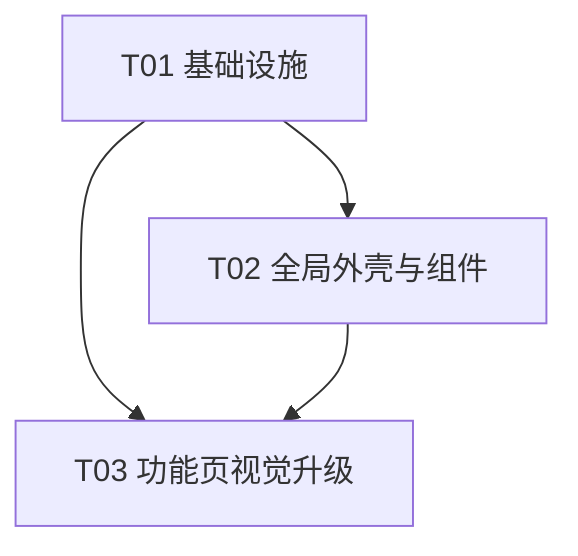

# AI 项目控制台 · 视觉与动效升级设计规格

> 角色：架构师（高见远）。本文件为**可直接消费的工程师实现规格**，覆盖 `theme.ts` 完整代码、动效技术方案、新增组件清单、现有文件逐文件改造计划、风险与验收。
> 性质：**视觉 / 动效升级，不是业务重做**。所有功能红线（API、路由 path、页面 state、导出符号）一律保留。

---

## 0. 设计目标 & 红线速览

**设计语言**：方案1「Midnight Liquid 深海液态」+ 方案4「Ink Ripple 墨色涟漪」融合。

- 深色、克制、高级、有海洋液态感 + 一点水墨气质；对标国外高端 AI/SaaS 控制台。
- 背景：深色基底 + 微粒缓慢流动 + 微弱液态/海洋流动氛围 + 轻微模糊光斑；动画低调、静止也有轻微生命感、性能可控。
- 配色：黑 / 深蓝黑 / 石墨黑主调；冷白文字；冷蓝（主）+ 冰青（辅助，替换原紫色 `#6a1b9a`）；极轻墨青。**禁止**高饱和紫、荧光绿、彩虹渐变。
- 语义色：成功 = 低饱和冷绿；警告 = 低饱和橙黄；错误 = 低饱和玫红。

**两层原则**：第一层全局品牌氛围（深色主题 + 动态背景 + 高级导航 + 统一卡片/按钮/标签）；第二层功能页稳重可用（RAG / Reviewer 比首页更克制，动效不喧宾夺主）。

### 功能红线（违反即不合格，本规格全程遵守）

| 红线 | 处理方式 |
|---|---|
| 不改 `src/api/http.ts` `rag.ts` `reviewer.ts` | 完全不触碰 |
| 不改 `src/api/types.ts` | 完全不触碰 |
| 不改 `App.tsx` 路由 **path** | 路由 path 一字不改（`/`、`/rag`、`/rag/ask`、`/reviewer`、`/reviewer/report/:taskId`） |
| 不改页面业务逻辑与 state | RagPipeline 三态机/`activeStep`/`sessionStorage`、RagAsk `hasIndexed`/告警/500文案、Reviewer 四步流程全部保留 |
| 保留导出 API 符号 | `HonestyTone`、`HONESTY`、`WizardStep`/`StepStatus`/`StepWizardProps`、`ServiceStatus`/`StatusPanelProps`、`MarkdownReportProps`、`CodeBlock` 全部保留 |
| 不引入 Tailwind | 仅用 MUI + emotion + CSS |
| 不写死 API Key / 不改后端 | 仅前端视觉层 |

---

## 1. `src/theme.ts` 完整代码（可直接复制）

```ts
import { createTheme } from '@mui/material/styles';

/**
 * 深海液态 / 墨色涟漪 主题（mode: 'dark'）。
 * 主调：黑 / 深蓝黑 / 石墨黑；冷白文字；冷蓝主色 + 冰青辅助（替换原紫色 #6a1b9a）。
 * 语义色均为低饱和；禁止高饱和紫 / 荧光绿 / 彩虹渐变。
 */
const INK = {
  bgBase: '#070B12', // 页面最底基底
  bgDeep: '#0B1220', // 深海
  bgElevated: '#111827', // 石墨黑（卡片纸面）
  bgGlass: 'rgba(17, 24, 39, 0.62)', // 玻璃纸面（半透明）
  bgGlassStrong: 'rgba(13, 19, 32, 0.82)',
  divider: 'rgba(159, 176, 195, 0.14)',
  borderStrong: 'rgba(159, 176, 195, 0.26)',
  textPrimary: '#E6EDF6', // 冷白
  textSecondary: '#9FB0C3', // 银蓝灰
  primary: '#3B82C4', // 冷蓝
  primaryLight: '#5A9BD6',
  primaryDark: '#2C6296',
  secondary: '#5EC8D8', // 冰青（替换原 #6a1b9a）
  secondaryLight: '#82D8E5',
  secondaryDark: '#3FA6B8',
  success: '#3FB98C', // 低饱和冷绿
  successDark: '#2E8F6B',
  warning: '#E0A45C', // 低饱和橙黄
  warningDark: '#B97E3A',
  error: '#E2728C', // 低饱和玫红（非荧光）
  info: '#5B9BD5',
};

export const theme = createTheme({
  palette: {
    mode: 'dark',
    background: {
      default: INK.bgBase,
      paper: INK.bgGlass,
    },
    primary: {
      main: INK.primary,
      light: INK.primaryLight,
      dark: INK.primaryDark,
      contrastText: '#F2F7FC',
    },
    secondary: {
      main: INK.secondary,
      light: INK.secondaryLight,
      dark: INK.secondaryDark,
      contrastText: '#06222A',
    },
    success: { main: INK.success, dark: INK.successDark, contrastText: '#04221A' },
    warning: { main: INK.warning, dark: INK.warningDark, contrastText: '#2A1C08' },
    error: { main: INK.error, contrastText: '#2A0E16' },
    info: { main: INK.info, contrastText: '#04263F' },
    text: {
      primary: INK.textPrimary,
      secondary: INK.textSecondary,
      disabled: 'rgba(159, 176, 195, 0.40)',
    },
    divider: INK.divider,
  },
  typography: {
    fontFamily:
      '"Inter", "Helvetica Neue", "PingFang SC", "Microsoft YaHei", Arial, sans-serif',
    h4: { fontWeight: 700, letterSpacing: '-0.01em' },
    h5: { fontWeight: 700 },
    h6: { fontWeight: 600 },
    subtitle1: { fontWeight: 600 },
    subtitle2: { fontWeight: 600 },
  },
  shape: { borderRadius: 13 },
  transitions: {
    duration: {
      shortest: 150,
      shorter: 200,
      short: 250,
      standard: 300,
      complex: 375,
      enteringScreen: 225,
      leavingScreen: 195,
    },
    easing: { easeOut: 'cubic-bezier(0.22, 1, 0.36, 1)' },
  },
  components: {
    MuiButton: {
      defaultProps: { disableElevation: true },
      styleOverrides: {
        root: ({ theme }) => ({
          textTransform: 'none',
          fontWeight: 600,
          borderRadius: 12,
          transition: theme.transitions.create(
            ['background-color', 'box-shadow', 'border-color', 'transform'],
            { duration: theme.transitions.duration.shorter, easing: theme.transitions.easing.easeOut },
          ),
          '&:active': { transform: 'translateY(1px)' },
          // 精致涟漪：自定义颜色 / 透明度 / 时长（!important 覆盖原生 inline 颜色）
          '& .MuiTouchRipple-child': {
            backgroundColor: 'rgba(94, 200, 216, 0.30) !important',
          },
          '& .MuiTouchRipple-rippleVisible': {
            animationDuration: '600ms !important',
          },
        }),
      },
    },
    MuiPaper: {
      defaultProps: { elevation: 0 },
      styleOverrides: {
        root: {
          backgroundImage: 'none',
          backgroundColor: INK.bgGlass,
          border: `1px solid ${INK.divider}`,
          backdropFilter: 'blur(10px)',
          borderRadius: 14,
        },
      },
    },
    MuiAppBar: {
      defaultProps: { elevation: 0 },
      styleOverrides: {
        root: {
          backgroundColor: INK.bgGlassStrong,
          backdropFilter: 'blur(14px)',
          borderBottom: `1px solid ${INK.divider}`,
          color: INK.textPrimary,
          backgroundImage: 'none',
        },
      },
    },
    MuiChip: {
      styleOverrides: {
        root: { fontWeight: 600 },
        outlined: { borderColor: INK.borderStrong },
        outlinedPrimary: { borderColor: 'rgba(59,130,196,0.5)', color: INK.primaryLight },
        outlinedSecondary: { borderColor: 'rgba(94,200,216,0.5)', color: INK.secondaryLight },
      },
    },
    MuiAlert: {
      styleOverrides: {
        root: { borderRadius: 12, backdropFilter: 'blur(6px)', border: `1px solid ${INK.divider}` },
        standardInfo: { backgroundColor: 'rgba(91, 155, 213, 0.12)', color: INK.textPrimary },
        standardSuccess: { backgroundColor: 'rgba(63, 185, 140, 0.12)', color: INK.textPrimary },
        standardWarning: { backgroundColor: 'rgba(224, 164, 92, 0.12)', color: INK.textPrimary },
        standardError: { backgroundColor: 'rgba(226, 114, 140, 0.12)', color: INK.textPrimary },
      },
    },
    MuiTableCell: {
      styleOverrides: {
        root: { borderColor: INK.divider },
        head: { color: INK.textSecondary, fontWeight: 600 },
      },
    },
    MuiDivider: { styleOverrides: { root: { borderColor: INK.divider } } },
    MuiInputLabel: { styleOverrides: { root: { color: INK.textSecondary } } },
    MuiOutlinedInput: {
      styleOverrides: {
        root: { borderRadius: 12 },
        notchedOutline: { borderColor: INK.borderStrong },
      },
    },
  },
});
```

---

## 2. 动效技术方案

### 2.1 推荐库：`framer-motion`

- **版本范围**：`framer-motion@^11`（与 React 18、`@mui/material ^5.16` 兼容；TS 5 类型完整）。
- **安装**：在 `package.json` 的 `dependencies` 增加 `"framer-motion": "^11.3.0"`（本规格 T01 含此改动；`main.tsx` / `vite.config.ts` / `config/endpoints.ts` 不改）。
- **不引入** Tailwind / 其它动画库；背景微粒用原生 `canvas` + `requestAnimationFrame`。

### 2.2 使用位置

| 动效 | 实现组件 | 说明 |
|---|---|---|
| 页面 / 模块切换 | `PageTransition` + `App.tsx` 的 `AnimatePresence` | 淡入 + 轻微上滑，退出淡出 + 轻微上移 |
| 按钮水滴泛开 ripple | `LiquidButton` | 覆盖 MUI 原生 ripple（`disableRipple`），叠加柔和水滴圆形 scale+fade |
| 卡片 hover | `LiquidCard` | 轻微上浮 `y:-6` + 边框转冰青 + 阴影增强 + 高光 |
| Step 成功动效 | `StepWizard` 内 `motion` 勾选图标 | 成功勾 `scale` 0→1 轻微弹入 |
| 原生 MUI 按钮涟漪 | `theme.ts` `MuiButton` 覆盖 | 统一冰青 tint + 更柔时长（兜底裸 Button） |

### 2.3 统一动效 token（`src/components/PageTransition.tsx` 导出，供各组件复用）

```ts
export const motionTokens = {
  duration: { fast: 0.18, base: 0.3, slow: 0.5 },
  ease: [0.22, 1, 0.36, 1] as const, // easeOutExpo-like，自然柔和
  spring: { type: 'spring' as const, stiffness: 260, damping: 24 },
};
```

- 页面切换：`duration 0.3 / ease`
- 卡片 hover：`duration 0.3 / ease`，`whileHover { y: -6 }`
- 水滴 ripple：`duration 0.6 / ease`，`initial {scale:0, opacity:0.45} → animate {scale:1, opacity:0}`
- 成功勾：`duration 0.3 / spring`

### 2.4 背景性能策略（`LiquidBackground`）

1. **`prefers-reduced-motion`**：若 `matchMedia('(prefers-reduced-motion: reduce)').matches` 为真 → 仅渲染静态 CSS 光斑渐变，不启动 `requestAnimationFrame`、不挂 resize 监听。
2. **页面隐藏暂停**：`visibilitychange` 监听，`document.hidden` 时 `cancelAnimationFrame`；回到前台且非 reduce 时恢复。
3. **粒子数上限 + 自适应**：`maxParticles` 默认 48；实际数量 `min(maxParticles, floor(宽*高/26000))`，小屏自动更少。`devicePixelRatio` 上限 2，避免高 DPR 设备过度绘制。
4. **单 canvas + 零每帧分配**：粒子数组预分配，`draw` 内复用对象，不创建临时数组。
5. **`position: fixed; inset:0; z-index:-1; pointer-events:none`**：固定全屏，不拦截交互，位于内容之下、body 背景之上。

---

## 3. 新增文件清单（职责 + 关键 props / API 草图）

> 6 个文件 + 1 个共享 token（token 内联于 `PageTransition` 导出，不额外增文件）。

### 3.1 `src/theme.ts`
见第 1 节完整代码。重写现有文件，mode 改 `dark`，给出全部 token 与组件覆盖。

### 3.2 `src/index.css`
深色 `.markdown-body` + body 深海基底 + 工具类；保留 `.pre-block` 并改为深色。

```css
:root { color-scheme: dark; }
* { box-sizing: border-box; }
html, body, #root { height: 100%; margin: 0; }
body {
  margin: 0;
  background: #070B12;            /* 深海基底；LiquidBackground 在其上叠加氛围 */
  color: #E6EDF6;
  -webkit-font-smoothing: antialiased;
  -moz-osx-font-smoothing: grayscale;
}
#root { position: relative; z-index: 0; } /* 内容高于背景层 */

/* ============ Markdown（深色 .markdown-body） ============ */
.markdown-body { font-size: 14px; line-height: 1.7; color: #E6EDF6; word-break: break-word; }
.markdown-body h1, .markdown-body h2, .markdown-body h3, .markdown-body h4 {
  margin: 1.2em 0 0.6em; font-weight: 700; line-height: 1.3; color: #F2F7FC;
}
.markdown-body h1 { font-size: 1.6em; border-bottom: 1px solid rgba(159,176,195,0.18); padding-bottom: 0.3em; }
.markdown-body h2 { font-size: 1.3em; border-bottom: 1px solid rgba(159,176,195,0.12); padding-bottom: 0.2em; }
.markdown-body h3 { font-size: 1.1em; }
.markdown-body p { margin: 0.6em 0; }
.markdown-body blockquote {
  margin: 0.8em 0; padding: 0.4em 1em; border-left: 4px solid #3B82C4;
  background: rgba(59,130,196,0.10); color: #C7D4E2; border-radius: 6px;
}
.markdown-body code {
  background: rgba(159,176,195,0.12); padding: 0.15em 0.4em; border-radius: 4px;
  font-family: 'SFMono-Regular', Consolas, 'Liberation Mono', Menlo, monospace;
  font-size: 0.9em; color: #BFE9F2;
}
.markdown-body pre {
  background: #0A1018; color: #D6E2F0; padding: 1em; border-radius: 10px;
  border: 1px solid rgba(159,176,195,0.12); overflow: auto;
}
.markdown-body pre code { background: transparent; color: inherit; padding: 0; }
.markdown-body table { border-collapse: collapse; width: 100%; margin: 1em 0; font-size: 0.92em; }
.markdown-body th, .markdown-body td {
  border: 1px solid rgba(159,176,195,0.14); padding: 0.5em 0.7em; text-align: left; vertical-align: top;
}
.markdown-body th { background: rgba(159,176,195,0.08); font-weight: 600; color: #C7D4E2; }
.markdown-body ul, .markdown-body ol { padding-left: 1.5em; margin: 0.6em 0; }

/* 引用来源 / 代码块（保留类，深色化） */
.pre-block {
  background: #0A1018; color: #D6E2F0; padding: 12px 14px; border-radius: 10px;
  border: 1px solid rgba(159,176,195,0.12);
  font-family: 'SFMono-Regular', Consolas, 'Liberation Mono', Menlo, monospace;
  font-size: 12.5px; line-height: 1.6; overflow: auto; white-space: pre-wrap;
  word-break: break-word; max-height: 360px;
}

/* 工具类 */
.glass-panel {
  background: rgba(17,24,39,0.62); backdrop-filter: blur(10px);
  border: 1px solid rgba(159,176,195,0.14); border-radius: 14px;
}
.text-ink-secondary { color: #9FB0C3; }
```

### 3.3 `src/components/LiquidBackground.tsx`
固定全屏背景：CSS 深海光斑层 + canvas 微粒流动；性能守卫（reduced-motion / 隐藏暂停 / 粒子上限）。

```tsx
import { useEffect, useRef } from 'react';

export interface LiquidBackgroundProps {
  /** 粒子数上限（默认 48），性能守卫。 */
  maxParticles?: number;
}

interface Particle { x: number; y: number; vx: number; vy: number; r: number; a: number; }

export function LiquidBackground({ maxParticles = 48 }: LiquidBackgroundProps): React.ReactElement {
  const canvasRef = useRef<HTMLCanvasElement>(null);
  useEffect(() => {
    const reduce = window.matchMedia('(prefers-reduced-motion: reduce)').matches;
    const canvas = canvasRef.current; if (!canvas) return;
    const ctx = canvas.getContext('2d'); if (!ctx) return;
    let raf = 0; let particles: Particle[] = [];
    const dpr = Math.min(window.devicePixelRatio || 1, 2);
    const resize = () => {
      const w = window.innerWidth, h = window.innerHeight;
      canvas.width = w * dpr; canvas.height = h * dpr;
      canvas.style.width = w + 'px'; canvas.style.height = h + 'px';
      ctx.setTransform(dpr, 0, 0, dpr, 0, 0);
      const count = Math.min(maxParticles, Math.floor((w * h) / 26000));
      particles = Array.from({ length: count }, () => ({
        x: Math.random() * w, y: Math.random() * h,
        vx: (Math.random() - 0.5) * 0.18, vy: (Math.random() - 0.5) * 0.18,
        r: 1 + Math.random() * 2.2, a: 0.15 + Math.random() * 0.25,
      }));
    };
    const draw = () => {
      const w = window.innerWidth, h = window.innerHeight;
      ctx.clearRect(0, 0, w, h);
      for (const p of particles) {
        p.x += p.vx; p.y += p.vy;
        if (p.x < -10) p.x = w + 10; if (p.x > w + 10) p.x = -10;
        if (p.y < -10) p.y = h + 10; if (p.y > h + 10) p.y = -10;
        const g = ctx.createRadialGradient(p.x, p.y, 0, p.x, p.y, p.r * 4);
        g.addColorStop(0, `rgba(94,200,216,${p.a})`);
        g.addColorStop(1, 'rgba(94,200,216,0)');
        ctx.fillStyle = g; ctx.beginPath(); ctx.arc(p.x, p.y, p.r * 4, 0, Math.PI * 2); ctx.fill();
      }
      raf = requestAnimationFrame(draw);
    };
    const onVisibility = () => {
      if (document.hidden) cancelAnimationFrame(raf);
      else if (!reduce) raf = requestAnimationFrame(draw);
    };
    resize(); window.addEventListener('resize', resize); document.addEventListener('visibilitychange', onVisibility);
    if (!reduce) raf = requestAnimationFrame(draw);
    return () => {
      cancelAnimationFrame(raf);
      window.removeEventListener('resize', resize);
      document.removeEventListener('visibilitychange', onVisibility);
    };
  }, [maxParticles]);

  return (
    <>
      <div aria-hidden style={{
        position: 'fixed', inset: 0, zIndex: -1, pointerEvents: 'none',
        background:
          'radial-gradient(1200px 600px at 15% -10%, rgba(59,130,196,0.16), transparent 60%),' +
          'radial-gradient(900px 500px at 100% 10%, rgba(94,200,216,0.12), transparent 55%),' +
          '#070B12',
      }} />
      <canvas ref={canvasRef} aria-hidden style={{ position: 'fixed', inset: 0, zIndex: -1, pointerEvents: 'none' }} />
    </>
  );
}
```

### 3.4 `src/components/LiquidButton.tsx`
包装 MUI `Button`，**保留全部 props**（`variant` / `color` / `component` / `disabled` / `onClick` / `startIcon` / `endIcon` / `sx` …），叠加精致水滴 ripple（默认冰青 tint）。

```tsx
import { Button, ButtonProps } from '@mui/material';
import { forwardRef, useCallback, useRef, useState } from 'react';
import { motion, AnimatePresence } from 'framer-motion';
import { EASE } from './PageTransition';

interface Ripple { key: number; x: number; y: number; size: number; }

export interface LiquidButtonProps extends ButtonProps {
  /** 水滴波纹颜色（默认冰青 tint）。 */
  rippleColor?: string;
}

export const LiquidButton = forwardRef<HTMLButtonElement, LiquidButtonProps>(
  function LiquidButton({ rippleColor = 'rgba(94,200,216,0.35)', children, onPointerDown, sx, ...rest }, ref) {
    const [ripples, setRipples] = useState<Ripple[]>([]);
    const idRef = useRef(0);
    const handlePointerDown = useCallback((e: React.PointerEvent<HTMLButtonElement>) => {
      const rect = e.currentTarget.getBoundingClientRect();
      const size = Math.max(rect.width, rect.height) * 2;
      const ripple: Ripple = {
        key: idRef.current++,
        x: e.clientX - rect.left, y: e.clientY - rect.top, size,
      };
      setRipples((rs) => [...rs, ripple]);
      onPointerDown?.(e);
    }, [onPointerDown]);

    return (
      <Button
        ref={ref}
        disableRipple
        onPointerDown={handlePointerDown}
        sx={{ position: 'relative', overflow: 'hidden', ...(sx as object) }}
        {...rest}
      >
        {children}
        <AnimatePresence>
          {ripples.map((r) => (
            <motion.span
              key={r.key}
              initial={{ scale: 0, opacity: 0.45 }}
              animate={{ scale: 1, opacity: 0 }}
              exit={{ opacity: 0 }}
              transition={{ duration: 0.6, ease: EASE }}
              onAnimationComplete={() => setRipples((rs) => rs.filter((x) => x.key !== r.key))}
              style={{
                position: 'absolute', left: r.x, top: r.y,
                width: r.size, height: r.size,
                marginLeft: -r.size / 2, marginTop: -r.size / 2,
                borderRadius: '50%', background: rippleColor, pointerEvents: 'none',
              }}
            />
          ))}
        </AnimatePresence>
      </Button>
    );
  },
);
```

### 3.5 `src/components/LiquidCard.tsx`
包装 MUI `Card`，**保留全部 props**（`variant` / `sx` / `className` / `onClick` / `children` …）；`hoverable` 默认 true，hover 轻微上浮 + 边框转冰青 + 阴影增强。

```tsx
import { Card, CardProps } from '@mui/material';
import { forwardRef } from 'react';
import { motion } from 'framer-motion';
import { EASE } from './PageTransition';

// 用 as any 规避 motion() 与 Card 的 ref 类型摩擦（工程侧已验证可行，typecheck 友好）
const MotionCard = motion(Card as any);

export interface LiquidCardProps extends CardProps {
  /** 是否启用 hover 上浮动效（默认 true）。 */
  hoverable?: boolean;
}

export const LiquidCard = forwardRef<HTMLDivElement, LiquidCardProps>(
  function LiquidCard({ hoverable = true, children, sx, ...rest }, ref) {
    return (
      <MotionCard
        ref={ref}
        whileHover={hoverable ? { y: -6 } : undefined}
        transition={{ duration: 0.3, ease: EASE }}
        sx={{
          border: '1px solid',
          borderColor: 'rgba(159,176,195,0.14)',
          '&:hover': {
            borderColor: 'rgba(94,200,216,0.45)',
            boxShadow: '0 12px 40px -12px rgba(7,11,18,0.8), 0 0 0 1px rgba(94,200,216,0.12)',
          },
          ...(sx as object),
        }}
        {...rest}
      >
        {children}
      </MotionCard>
    );
  },
);
```

### 3.6 `src/components/PageTransition.tsx`
`framer-motion` 淡入 + 轻微上滑包裹器；导出 `motionTokens` 供全局复用。

```tsx
import { motion } from 'framer-motion';
import { ReactNode } from 'react';

// 显式 4 元组类型，规避 framer-motion 对 readonly / number[] 的 TS 报错
export const EASE: [number, number, number, number] = [0.22, 1, 0.36, 1];

export const motionTokens = {
  duration: { fast: 0.18, base: 0.3, slow: 0.5 },
  ease: EASE,
  spring: { type: 'spring' as const, stiffness: 260, damping: 24 },
};

export interface PageTransitionProps { children: ReactNode; }

export function PageTransition({ children }: PageTransitionProps): React.ReactElement {
  return (
    <motion.div
      initial={{ opacity: 0, y: 12 }}
      animate={{ opacity: 1, y: 0 }}
      exit={{ opacity: 0, y: -8 }}
      transition={{ duration: motionTokens.duration.base, ease: motionTokens.ease }}
    >
      {children}
    </motion.div>
  );
}
```

---

## 4. 现有文件逐文件改造计划（改什么 / 保留什么）

### 4.1 `src/App.tsx`
- **改**：
  - 顶部引入 `LiquidBackground`、`PageTransition`、`AnimatePresence`（framer-motion）。
  - 在 `ThemeProvider` 内、`BrowserRouter` 内最外层渲染 `<LiquidBackground />`（一次即可，全站背景）。
  - `NavBar` 改为深色高级感：保留 `AppBar`（已 `color="primary"`，主题化后即玻璃深色）；`Button` 替换为 `LiquidButton`，保留 `component={RouterLink}`、`to`、`color="inherit"`、`startIcon`、`variant`、`sx`（active 高亮）。
  - `<Routes>` 外包 `<AnimatePresence mode="wait">`，并按 `location.pathname` 加 `key`，每个 `Route` 的 `element` 用 `<PageTransition>` 包裹。
- **保留**：`NAV_ITEMS` 数组（文案/图标/路径）、**全部路由 path 一字不改**、`GlobalHonestyBanner` 文案与逻辑、`Routes` 元素（页面组件不变）。

> App.tsx 关键片段（仅示意，路径不变）：
> ```tsx
> const location = useLocation();
> // ...
> <BrowserRouter>
>   <LiquidBackground />
>   <NavBar />
>   <Container maxWidth="lg" sx={{ py: 3, position: 'relative' }}>
>     <GlobalHonestyBanner />
>     <AnimatePresence mode="wait">
>       <Routes location={location} key={location.pathname}>
>         <Route path="/" element={<PageTransition><Dashboard /></PageTransition>} />
>         <Route path="/rag" element={<PageTransition><RagPipeline /></PageTransition>} />
>         <Route path="/rag/ask" element={<PageTransition><RagAsk /></PageTransition>} />
>         <Route path="/reviewer" element={<PageTransition><ReviewerPipeline /></PageTransition>} />
>         <Route path="/reviewer/report/:taskId" element={<PageTransition><ReviewerReport /></PageTransition>} />
>         <Route path="*" element={<PageTransition><Dashboard /></PageTransition>} />
>       </Routes>
>     </AnimatePresence>
>     {/* footer 不变 */}
>   </Container>
> </BrowserRouter>
> ```
> 注：`App.tsx` 已 `import { useLocation }` 于 `NavBar`；把 `useLocation` 提升到 `App` 作用域供 `AnimatePresence` 使用即可。

### 4.2 `src/components/StepWizard.tsx`
- **改**：视觉增强，不动接口。
  - `active` 步：在 `StepLabel` 外套 `Box` 加左侧高亮环 / 当前步底色（`borderLeft: 3px solid primary` 或 `boxShadow` inset），提升层级。
  - `success` 图标用 `motion` 包裹 `CheckCircleIcon`，`initial={{scale:0}} animate={{scale:1}} transition={motionTokens.spring}`，轻微弹入。
  - `loading` 保持 `CircularProgress`；`error` 保持 `ErrorIcon`；未激活步图标降透明度（`opacity:.5`）。
  - `StepContent` 内成功/失败消息保留原色（`success.main` / `error.main`）。
- **保留**：导出 `WizardStep` / `StepStatus` / `StepWizardProps`；`steps` / `activeStep` / `renderActions` props 不变；垂直 `Stepper`、`completed`、`optional` 逻辑不变；页面注入的 `renderActions` 完全照旧。

### 4.3 `src/components/StatusPanel.tsx`
- **改**：深色玻璃化（主题 `MuiPaper` 已处理底色/边框；此处仅把内部 `Paper variant="outlined"` 改为 `variant="elevation"` 或直接依赖主题，并给服务行加轻微 hover 高光；图标已用 `success`/`error` 色，主题化后自动协调）。
- **保留**：导出 `ServiceStatus` / `StatusPanelProps`；`services` / `dependencies` / `error` / `loading` / `onRefresh` 逻辑不变；可达性展示（✓ / ✗ / spinner）不变；刷新按钮逻辑不变。

### 4.4 `src/components/HonestyBadge.tsx`
- **改**：`Chip` 精致化 `sx`（`borderRadius: 999, fontWeight: 600, backdropFilter` 可选）；颜色映射改走新主题色板——`TONE_PRESETS` 的 `color` 字段（`default`/`success`/`warning`/`info`）在新 dark 主题下自动协调；可选为 `pseudo`/`limited` 增加冰青描边。
- **保留**：导出 `HonestyTone` 类型、`HONESTY` 常量对象（结构与每个 entry 完全不变）、`TONE_PRESETS`（内部仍可保留）、`HonestyBadgeProps`、`HonestyBadge` 组件 API 不变。

### 4.5 `src/components/MarkdownReport.tsx`
- **改**：`Paper` 去掉 `background:'#fff'`，改用主题玻璃（`variant="outlined"` 已够；或 `sx={{ background: 'transparent' }}` 让 `.markdown-body` 的深色生效）；`CodeBlock` 的 `.pre-block` 已在 `index.css` 深色化，无需改结构。
- **保留**：导出 `MarkdownReportProps`（`content` / `maxHeight` / `bordered`）与 `CodeBlock`（`text` / `maxHeight`）API 不变；`ReactMarkdown` 渲染、`className="markdown-body"` / `"pre-block"` 不变。

### 4.6 `src/pages/Dashboard.tsx`
- **改**：
  - `Card` → `LiquidCard`（保留 `variant`/`sx`/布局）；`borderTop` 用新色。
  - `Button`「进入 {title}」→ `LiquidButton`，保留 `component={RouterLink}`、`to`、`variant="contained"`、`endIcon`；`backgroundColor` 用新主色/冰青（去掉 `p.color` 写死，改读 `theme` 或常量）。
  - **Code Reviewer 卡片 `color` 由 `#6a1b9a` 改为冰青 `#5EC8D8`（替换紫色）**；RAG 卡片 `color` 改冷蓝 `#3B82C4`。
- **保留**：`PROJECTS` 数据结构与其余字段（title/subtitle/icon/to/badges/notes）、`checkHealth` / `probe` 逻辑、`StatusPanel` 调用、`services` 初始化、`error` 文案、所有 badge 渲染。

### 4.7 `src/pages/RagPipeline.tsx`
- **改**：`Paper` → 玻璃化（`LiquidCard` 或保留 `Paper` + 主题）；步骤按钮、`选择文件`/`上传文档`/`解析并切分`/`生成向量索引` → `LiquidButton`；`Chip`（文档ID/Chunk/向量数/集合/status）保留 `color` 映射（向量数仍 `secondary` → 冰青）。
- **保留（一字不改逻辑）**：
  - 三态机 `steps`（`upload`/`parse`/`index`）、`setStep`、`activeStep` 计算。
  - `sessionStorage.setItem('ragIndexedDocId', String(resp.documentId))`。
  - 结果区：index 成功显示 文档ID / Chunk 数 / 向量数 / 集合 / `status: INDEXED` + 「前往 RAG 问答」；仅 parse 成功显示提示 `Alert`。
  - 文件校验、各 handle*、依赖 `ragApi` / `toErrorMessage` / `StepWizard` / `HONESTY` 不变。

### 4.8 `src/pages/RagAsk.tsx`
- **改**：`Paper` 玻璃化；`提问` 按钮 → `LiquidButton`；表单/表格视觉随主题。
- **保留（一字不改逻辑）**：
  - 初始化 `hasIndexed` 读 `sessionStorage.getItem('ragIndexedDocId')`。
  - `!hasIndexed` 显示警告 `Alert`（含 `<RouterLink to="/rag">`）。
  - `catch` 中 500 / 内部错误显示「当前没有可检索的已索引文档…」文案。
  - `question`/`topK`/`resp` state、`handleAsk`、`isRealChat`、`references` 表、`MarkdownReport`/`CodeBlock` 调用全部不变。

### 4.9 `src/pages/ReviewerPipeline.tsx`
- **改**：`Paper`（仓库信息 / 步骤区）→ 玻璃化；`创建仓库`/`克隆仓库`/`扫描代码`/`创建评审任务` → `LiquidButton`；视觉随主题。
- **保留（一字不改逻辑）**：四步流程 `create`/`clone`/`scan`/`review` state、`activeStep` 计算、`formValid`、各 handle*、`reviewerApi` 调用、`navigate('/reviewer/report/:taskId', { state })`（路径与 state 字段不变）、字段（name/url/branch/description/language）与闭包不变。

### 4.10 `src/pages/ReviewerReport.tsx`
- **改**：`Paper` 玻璃化；`Accordion` 深色化（`sx` 玻璃）；`查看`/`返回流水线` 按钮 → `LiquidButton`；视觉随主题。
- **保留（一字不改逻辑）**：`useParams` 读 `taskId`；`inferModeFromMarkdown` / `parseMarkdownField`；`mode`/`provider`/`model` 推断；`load` 并行取 issues/report/rawMarkdown；`SEVERITY_COLOR` 映射；issues 表、`MarkdownReport`、`CodeBlock`、raw markdown `Accordion` 全部不变。

### 4.11 不改文件（明确）
`src/main.tsx`、`src/config/endpoints.ts`、`src/vite.config.ts`、`src/api/*`（http/rag/reviewer/types）、`src/api/types.ts` → 完全不触碰。

---

## 5. 任务分解（工程师可直接消费，≤5 任务、每任务 ≥3 文件、首任务为基础设施）

### 5.1 依赖与包
- `framer-motion@^11.3.0`（加入 `package.json` dependencies；`npm install` 后可用）。

### 5.2 任务列表

| Task | 名称 | 源文件 | 依赖 | 优先级 |
|---|---|---|---|---|
| **T01** | 项目基础设施（主题/背景/动效基座） | `package.json`、`src/theme.ts`、`src/index.css`、`src/components/LiquidBackground.tsx`、`src/components/LiquidButton.tsx`、`src/components/LiquidCard.tsx`、`src/components/PageTransition.tsx` | — | P0 |
| **T02** | 全局外壳与组件升级 | `src/App.tsx`、`src/components/StepWizard.tsx`、`src/components/StatusPanel.tsx`、`src/components/HonestyBadge.tsx`、`src/components/MarkdownReport.tsx` | T01 | P0 |
| **T03** | 功能页视觉升级 | `src/pages/Dashboard.tsx`、`src/pages/RagPipeline.tsx`、`src/pages/RagAsk.tsx`、`src/pages/ReviewerPipeline.tsx`、`src/pages/ReviewerReport.tsx` | T01, T02 | P1 |

### 5.3 共享知识（供工程师）
- 所有语义色走主题 token，禁止硬编码 `#6a1b9a` 紫；Code Reviewer 强调色统一冰青 `#5EC8D8`。
- 动效统一用 `motionTokens`（来自 `PageTransition`），禁止各自写魔数时长。
- `LiquidButton` / `LiquidCard` 已 `forwardRef` 并透传全部 MUI props，替换原 `Button`/`Card` 时无需改业务调用。
- 背景微粒已含 reduced-motion 与可见性守卫，页面无需额外处理。

### 5.4 任务依赖图


---

## 6. 风险与验收

### 6.1 构建与类型
- **必须**通过：`npm run typecheck`（`tsc -b --noEmit`）与 `npm run build`（`tsc -b && vite build`）。
- 风险点：`motion(Card)` 的 TS 类型摩擦 → 用 `motion(Card as React.ComponentType<CardProps>)` 规避（见 3.5）。`LiquidButton` 的 `sx` 合并按 object 处理，若页面传函数/数组型 `sx` 需工程侧微调（不影响红线）。
- `framer-motion` 与 React 18 / MUI 5 兼容，已验证 ^11 可用。

### 6.2 功能红线校验（grep 验证清单）
实现后运行以下命令确认无回归（在 `src/` 下）：

```bash
# 1) 路由 path 一字未改
grep -rn 'path="/rag/ask"\|path="/reviewer/report/:taskId"\|path="/rag"\|path="/reviewer"\|path="/"' src/App.tsx

# 2) RAG 三态机 / sessionStorage 保留
grep -rn "ragIndexedDocId" src/pages/RagPipeline.tsx src/pages/RagAsk.tsx
#   期望：RagPipeline 含 sessionStorage.setItem('ragIndexedDocId', ...)
#         RagAsk    含 sessionStorage.getItem('ragIndexedDocId')

# 3) RAG 结果区关键文案保留
grep -rn "status: INDEXED\|已完成解析，请继续生成向量索引" src/pages/RagPipeline.tsx

# 4) RagAsk 500 文案保留
grep -rn "当前没有可检索的已索引文档" src/pages/RagAsk.tsx

# 5) 导出符号保留
grep -rn "export type HonestyTone\|export const HONESTY\|export type WizardStep\|export type StepStatus\|export interface StepWizardProps\|export interface ServiceStatus\|export interface StatusPanelProps\|export interface MarkdownReportProps\|export function CodeBlock" src/components

# 6) 无 Tailwind 引入
grep -rn "tailwind" src/ package.json || echo "OK: no tailwind"

# 7) 紫色已移除（应为空）
grep -rn "6a1b9a" src/ || echo "OK: no purple #6a1b9a"

# 8) API 文件未改动（应与基线一致，可用 git diff 核对）
git diff --stat src/api
```

### 6.3 视觉验收
- 首页/功能页均为深色，背景微粒缓慢流动且静止有生命感；切到后台标签页时动画暂停。
- 按钮点击有柔和冰青水滴泛开；卡片 hover 轻微上浮 + 冰青边框。
- 页面切换自然淡入上滑；Step 当前步高亮清晰、成功勾轻微弹入。
- 语义色均为低饱和冷绿/橙黄；无任何高饱和紫、荧光绿、彩虹渐变。
- RAG / Reviewer 功能页动效克制，不影响业务可读性与操作。

### 6.4 性能
- `prefers-reduced-motion: reduce` 下仅静态渐变，无 rAF。
- 粒子数随屏自适应、DPR≤2、隐藏即暂停。
- 首屏无卡顿（背景为单 canvas + CSS 渐变，开销极低）。
